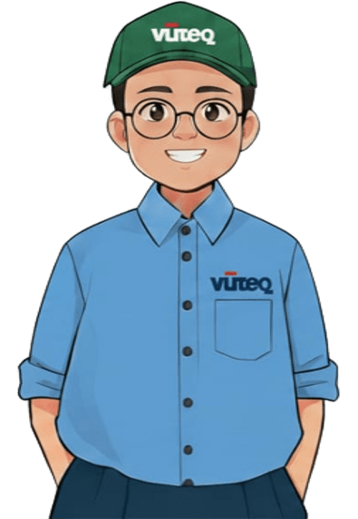

 

<table>
  <tr>
    <td align="center" width="30%">
      
       
      
    </td>
    <td align="left" width="70%">
      <h3>👋 Hello, I'm Wissa</h3>
      
A passionate <b>Fullstack Developer</b> and <b>Systems Engineer</b> dedicated to building scalable, efficient, and user-centric digital solutions. With a background in <b>IT Support</b>, I bridge the gap between robust infrastructure and high-quality software development.

      
    </td>
  </tr>
</table>

---

### 🛠️ Technical Ecosystem

  

---

### 📊 Github Performance

  
  

---

### 📬 Let's Connect

 

  
   
  Built with passion and clean code.

