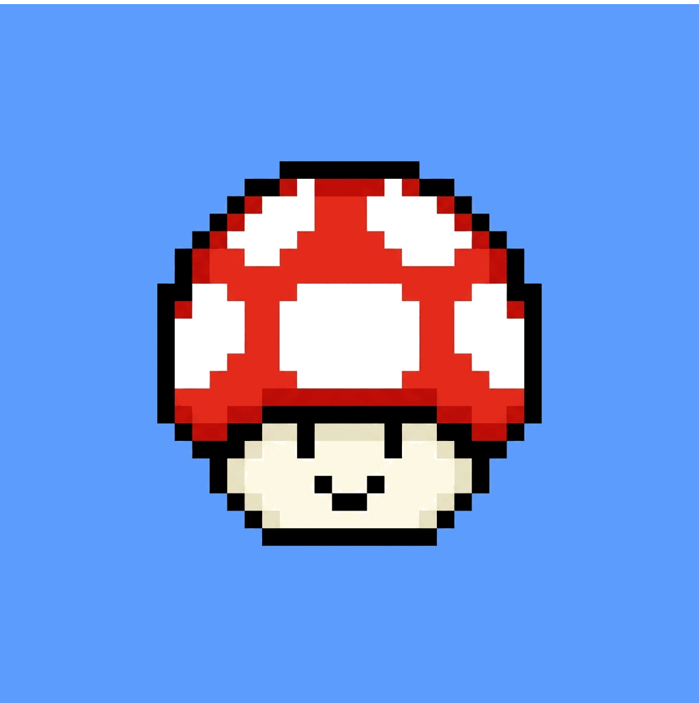
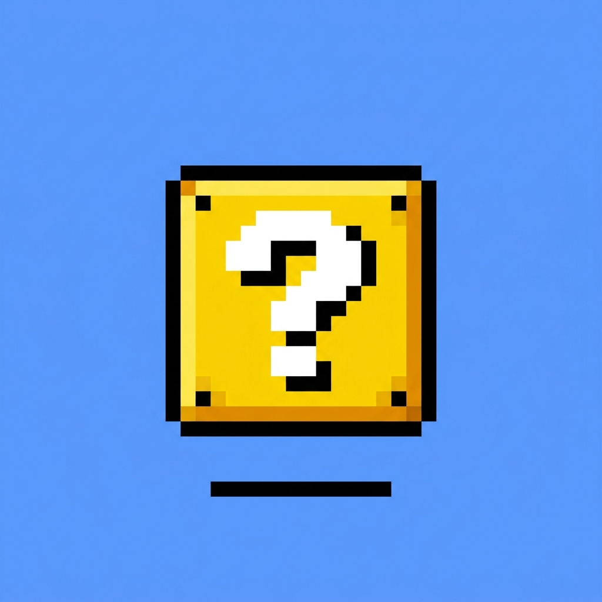

  

  

  

  

  <table style="border-collapse: collapse; border: none; margin: 0; padding: 0;">
    <tr style="border: none;">
      <td align="center" style="border: none; padding: 0;">
        
      </td>
      <td align="center" width="150" style="border: none; padding: 0;">
         
        
      </td>
    </tr>
  </table>

  

  

  
  
  
  
  
  
  
  
  
  
  
  
  
  
  

  

  

  
  

  

  

  
  
  

  

  

  
  &nbsp;
  

 

  
  
  
  &nbsp;&nbsp;
  
  &nbsp;&nbsp;
  
  
  
   
  

