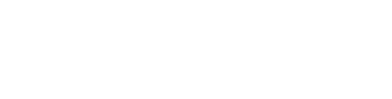
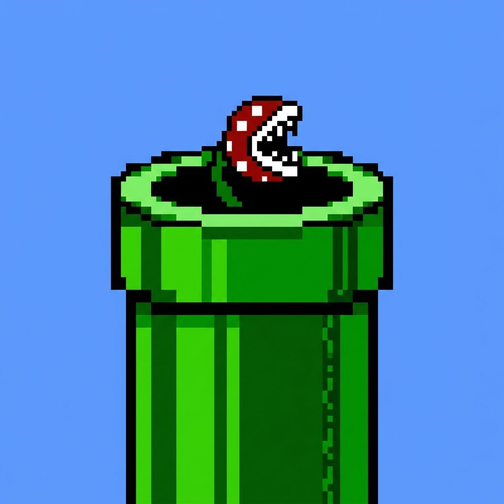

  

  

 

  
    
  

 

  

 

  <table style="border-collapse: collapse; border: none;">
    <tr style="border: none;">
      <td align="center" style="border: none;">
        
      </td>
      <td align="center" width="150" style="border: none;">
         
        
      </td>
    </tr>
  </table>

 

  

 

  

 

  
  
  
  
  
  
  
  
  
  
  
  
  
  
  

 

  

 

  

 

  
  
    

  

 

  

 

  

 

  
  
  

 

  

 

  

 

  
  &nbsp;
  

 

  
  
  &nbsp;&nbsp;
  
  &nbsp;&nbsp;
  
  
    
  

