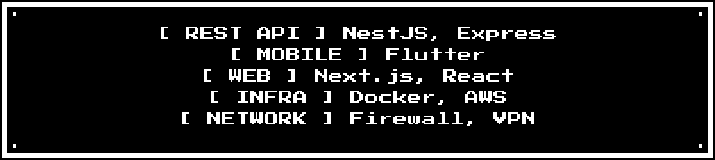
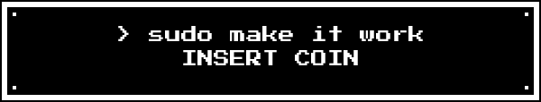

  

  

 

---

  

 

<table align="center" style="border: none;">
  <tr style="border: none;">
    <td align="center" valign="top" width="33%" style="border: none;">
        
      
    </td>
    <td align="center" valign="top" width="33%" style="border: none;">
        
      
    </td>
    <td align="center" valign="top" width="33%" style="border: none;">
        
      
    </td>
  </tr>
</table>

---

  

    
  

   
  
  

---

  

  
    
  

---

  
    
  

