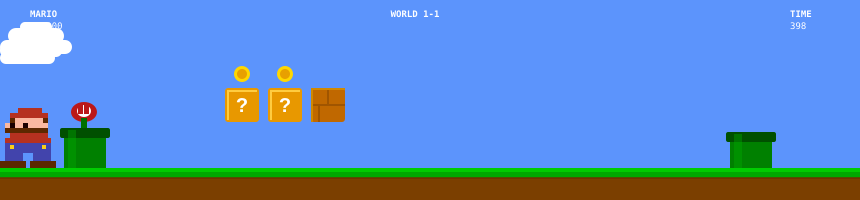
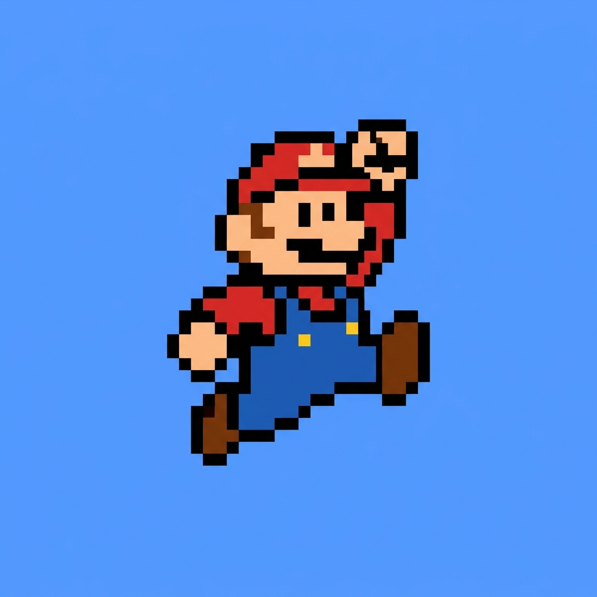
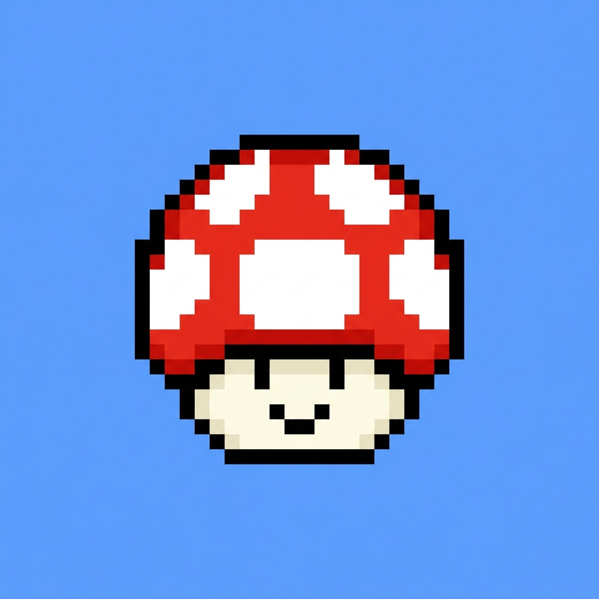

<div align="center">

</div>

<div align="center">

[](https://git.io/typing-svg)

</div>

---

<div align="center">

## `whoami`

<table><tr>
<td>

```ts
const wissa = {
  name  : "Wissa Gamma E.L.",
  role  : ["Fullstack Dev", "Mobile Dev", "Network Engineer"],
  stack : "NestJS · Flutter · Next.js · Docker · Fortinet",
  based : "Indonesia 🇮🇩",
};
```

</td>
<td align="center" width="130">
<br>
<sub><b>Player 1</b></sub>
</td>
</tr></table>

</div>

## `tech.stack`

<div align="center">


</div>

---

## `portfolio.status`

> Most repos are **private** — production systems, client APIs & internal tooling.

<div align="center">

| 🔌 REST API | 📱 Mobile | 🌐 Web | 🛠️ Infra | 🔐 Network |
|---|---|---|---|---|
| NestJS · Express | Flutter | Next.js · React | Docker · AWS | Firewall · VPN |

</div>

---

## `github.stats`

<div align="center">


</div>

---

## `contact`

<div align="center">

[](mailto:wissagamma@vuteq.co.id)
&nbsp;
[](https://github.com/kicik-ireng)

</div>

---

<div align="center">
&nbsp;&nbsp;<kbd>$ sudo make it work</kbd>&nbsp;&nbsp;<br>

</div>